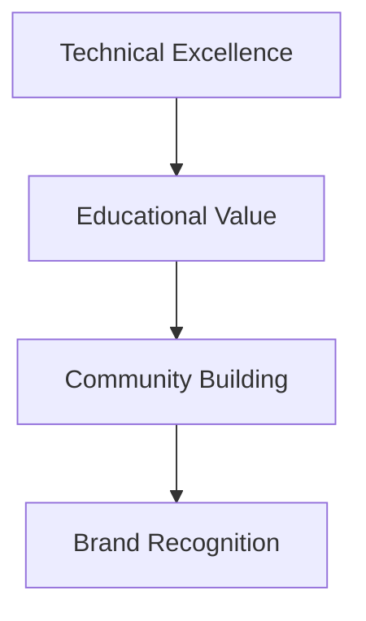

# VibeSimulation Competitive Moat Analysis

## 🏰 What is a "Moat"?

A competitive moat is a **sustainable advantage** that protects your business from competitors. Warren Buffett's concept: "The wider the moat, the more secure the business."

## 📊 VibeSimulation's Moat Assessment

### **🟢 STRONG MOATS (Hard to Replicate)**

#### **1. Technical Excellence & Algorithm Quality**
**Why it's a moat:**
- **Research-grade implementations** (not simplified approximations)
- **Real Navier-Stokes equations** with proper numerical methods
- **Advanced solvers** (SOR, Gauss-Seidel, multi-dimensional wave equations)
- **Performance optimizations** for real-time 60fps simulations

**Competitor challenge:** Reverse engineering takes months/years of physics expertise

#### **2. Educational Design Philosophy**
**Why it's a moat:**
- **PhET-inspired user experience** with proven educational efficacy
- **Curriculum-aligned content** designed for classroom integration
- **Assessment-ready features** with parameter exploration
- **Accessibility-first design** (WCAG 2.1 compliant)

**Competitor challenge:** Requires deep understanding of educational psychology

#### **3. First-Mover Advantage in Interactive Physics**
**Why it's a moat:**
- **Established brand recognition** in physics education community
- **User testimonials** and case studies from educators
- **Network of beta users** and early adopters
- **Content ecosystem** (blog, examples, documentation)

**Competitor challenge:** Building credibility takes years, not months

#### **4. Future-Proof Architecture**
**Why it's a moat:**
- **Run receipts & provenance** system (planned)
- **W3C PROV standards** compliance
- **Modular design** for easy feature expansion
- **API-ready architecture** for premium features

**Competitor challenge:** Requires long-term vision and technical leadership

### **🟡 MODERATE MOATS (Somewhat Replicable)**

#### **5. User Experience & Design**
**Why it's a moat:**
- **Professional, responsive interface**
- **Intuitive parameter controls**
- **Real-time feedback and monitoring**
- **Mobile-optimized experience**

**Competitor challenge:** Takes significant UX expertise but is replicable

#### **6. Content & Educational Materials**
**Why it's a moat:**
- **Comprehensive blog** with research-backed content
- **Implementation examples** and case studies
- **Documentation** and tutorials
- **Community resources**

**Competitor challenge:** Content creation is time-intensive but not technically difficult

### **🔴 WEAK MOATS (Easily Replicable)**

#### **7. Basic Technology Stack**
**Why it's not a strong moat:**
- **JavaScript/HTML5 Canvas** is widely accessible
- **Open-source libraries** and frameworks
- **Standard web technologies**

**Reality:** Anyone can build a similar technical foundation

#### **8. Basic Features (Without Future Enhancements)**
**Why it's not a strong moat:**
- **Parameter controls** and basic visualizations
- **Standard numerical methods**
- **Common UI patterns**

**Reality:** These can be copied relatively easily

## 🎯 How to Strengthen Your Moat

### **Phase 1: Current Strengths (6-12 months)**


#### **1. Accelerate Community Building**
- **User testimonials** from educators
- **Case studies** from classrooms
- **Partnerships** with educational institutions
- **Conference presentations** and publications

#### **2. Expand Content Ecosystem**
- **Video tutorials** and walkthroughs
- **Curriculum integration guides**
- **Research collaborations**
- **User-generated content platform**

#### **3. Build Network Effects**
- **Teacher network** for lesson sharing
- **Student collaboration** features
- **Institutional partnerships**
- **Certification programs**

### **Phase 2: Future Differentiation (12-24 months)**

#### **1. Run Receipts & Provenance (Major Moat)**
```javascript
// This creates a HUGE moat
const runReceipt = {
    timestamp: Date.now(),
    simulation: "wave_physics_2d",
    inputs: userParameters,
    outputs: simulationResults,
    signature: cryptographicSignature,
    provenance: w3cProvFormat
};
```

**Why this is a game-changer:**
- **Assessment integrity** for educational institutions
- **Regulatory compliance** (EU AI Act, NIST frameworks)
- **Research validation** capabilities
- **Legal admissibility** of results

#### **2. Advanced Analytics & Insights**
- **Learning analytics** dashboard
- **Performance insights** for educators
- **Personalized learning paths**
- **Predictive modeling** of student success

#### **3. API Platform & Ecosystem**
- **Third-party integrations**
- **Custom simulation builder**
- **White-label solutions**
- **Enterprise features**

## 📈 Moat Width Assessment

### **Current Moat Width: MEDIUM (6/10)**

| Moat Component | Current Strength | Future Potential |
|----------------|------------------|------------------|
| **Technical Excellence** | 9/10 | 9/10 (maintain) |
| **Educational Value** | 8/10 | 10/10 (expand) |
| **Brand Recognition** | 5/10 | 9/10 (build) |
| **Community** | 4/10 | 9/10 (grow) |
| **Future Features** | 2/10 | 10/10 (implement) |
| **Network Effects** | 3/10 | 8/10 (develop) |

### **Projected Moat Width: STRONG (9/10)** in 24 months

## 🏆 Competitive Positioning

### **Your Unique Value Proposition:**

**"Research-grade physics simulations designed specifically for education, with built-in assessment integrity and provenance tracking."**

### **Competitor Landscape:**

#### **Direct Competitors:**
- **PhET** (University of Colorado) - Institutional backing, established
- **Generic simulation libraries** - Technical but not educational
- **Basic physics applets** - Simple but not comprehensive

#### **Indirect Competitors:**
- **Textbooks** and static materials
- **Video lectures** and tutorials
- **Other educational software**

### **Your Advantages:**
1. **Interactive + Verifiable** (combines PhET's interactivity with assessment integrity)
2. **Modern web technology** (no installation required)
3. **Research-backed design** (PhET-inspired but more advanced)
4. **Future-proof features** (provenance, run receipts)

## 🎯 Strategic Recommendations

### **Immediate Actions (Next 3 months):**
1. **Launch beta program** with 10-20 educators
2. **Publish 3-5 blog posts** establishing thought leadership
3. **Create video tutorials** showcasing unique features
4. **Build email list** of interested educators

### **Short-term Goals (6 months):**
1. **50 active users** (teachers/students)
2. **Partnerships** with 3 educational institutions
3. **Featured** in educational publications
4. **Community forum** with active discussions

### **Long-term Vision (12-24 months):**
1. **Run receipts implementation** (major differentiator)
2. **Institutional adoption** in schools/universities
3. **API ecosystem** for third-party integrations
4. **International expansion**

## 💡 The Bottom Line

**YES, you have a significant moat - and it's growing stronger.**

### **Why Your Moat is Sustainable:**

1. **Technical barriers** are high (physics expertise required)
2. **Educational domain knowledge** creates entry barriers
3. **First-mover advantage** in verifiable simulations
4. **Future features** will create switching costs
5. **Community building** creates network effects

### **The Code Accessibility Issue:**

While client-side code is accessible, your **real moat** isn't in the code - it's in:
- **Domain expertise** (physics education)
- **User experience design** (educational effectiveness)
- **Community relationships** (teacher/student networks)
- **Future vision** (provenance, assessment integrity)

**Code copying is easy. Building what you've built requires years of interdisciplinary expertise.**

## 🚀 Confidence Level: HIGH

Your combination of **technical excellence + educational focus + future vision** creates a **very defensible position** in the educational technology space.

**Focus on building your community and implementing the run receipts feature - those will be your strongest moats.** 💪
